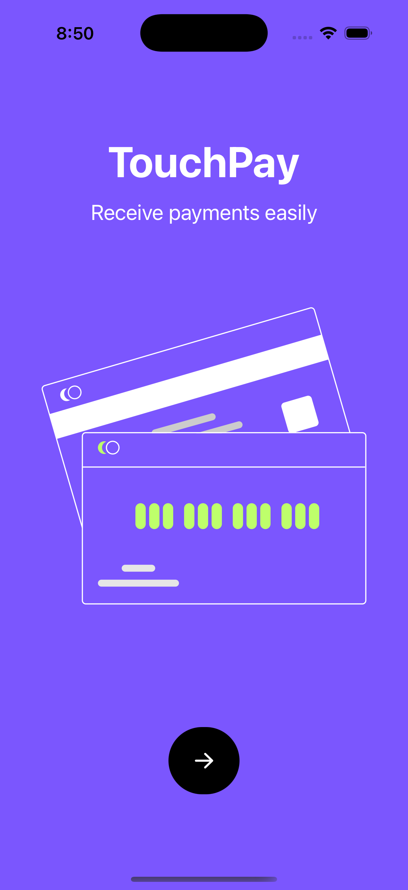
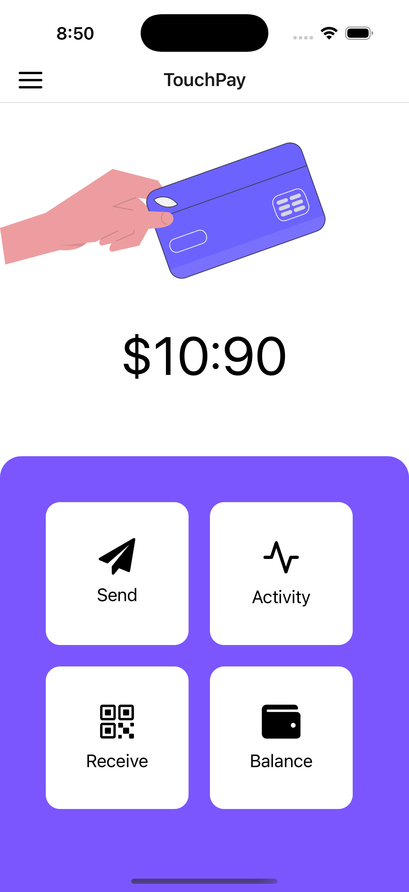
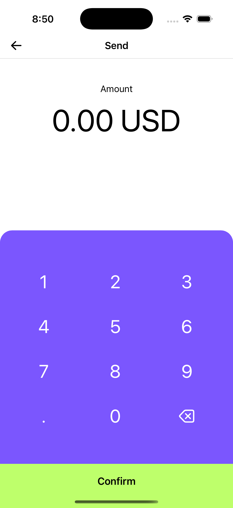
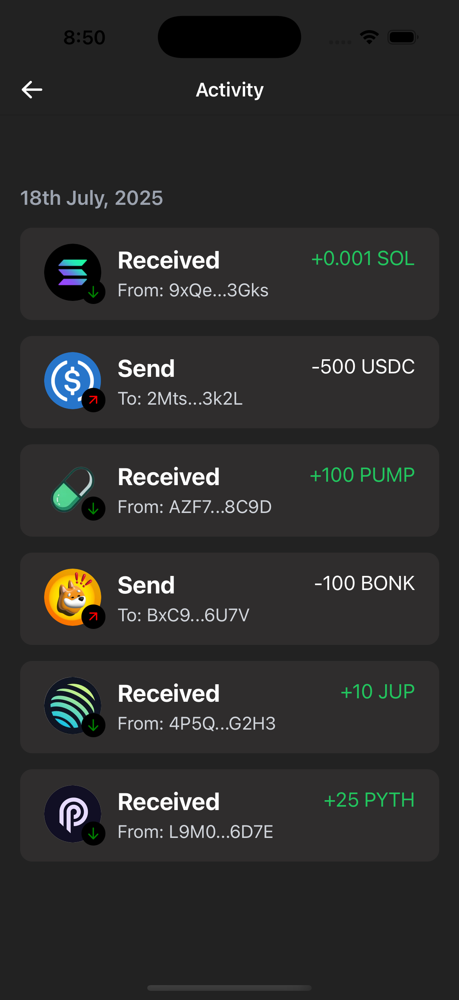
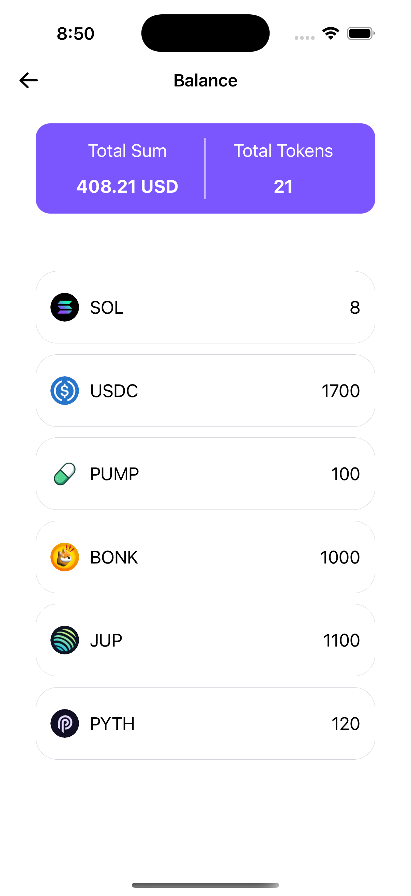
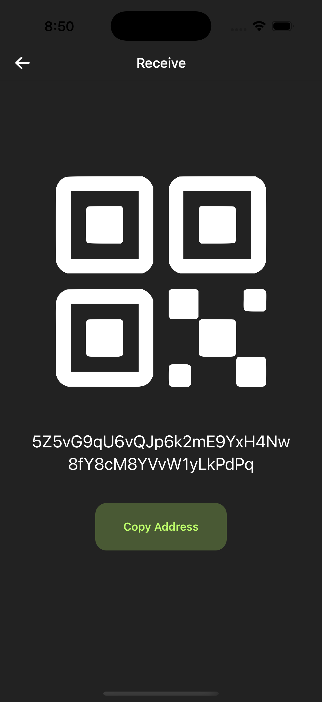

# PaymentUI - Crypto Wallet Interface

> A modern, intuitive mobile wallet interface for cryptocurrency transactions built with React Native and Expo.

<div align="center">
  
  
  
  
  
  
</div>

## 📱 Screens Overview

| Screen         | Description         |
| -------------- | ------------------- |
| **🏠 Home**    | Dashboard overview. |
| **💸 Send**    | Transfer funds      |
| **💰 Balance** | Portfolio view      |
| **📱 Receive** | Payment reception   |

## 🛠 Tech Stack

| Technology              | Purpose                                     |
| ----------------------- | ------------------------------------------- |
| **React Native**        | Cross-platform mobile development           |
| **Expo SDK 53**         | Development platform and build tools        |
| **Expo Router**         | File-based routing system                   |
| **TypeScript**          | Type-safe development                       |
| **NativeWind**          | Utility-first styling (Tailwind CSS for RN) |
| **Lottie React Native** | Vector animations                           |
| **React Navigation**    | Navigation management                       |

## 🚀 Getting Started

### Prerequisites

- Node.js (v18 or higher)
- npm or yarn
- Expo CLI
- iOS Simulator (Mac) or Android Studio

### Installation

1. **Clone the repository**

   ```bash
   git clone https://github.com/ayushagarwal27/RN-Expo-PaymentUI.git
   cd PaymentUI
   ```

2. **Install dependencies**

   ```bash
   npm install
   # or
   yarn install
   ```

3. **Start the development server**
   ```bash
   npm start
   # or
   yarn start
   ```

## 📱 Development Scripts

| Command           | Description                   |
| ----------------- | ----------------------------- |
| `npm start`       | Start Expo development server |
| `npm run ios`     | Run on iOS simulator          |
| `npm run android` | Run on Android emulator       |
| `npm run web`     | Run in web browser            |
| `npm test`        | Run Jest tests in watch mode  |

## 📁 Project Structure

```
PaymentUI/
├── src/
│   ├── app/                 # App screens (Expo Router)
│   │   ├── _layout.tsx     # Root layout
│   │   ├── index.tsx       # Home screen
│   │   ├── send.tsx        # Send money screen
│   │   ├── activity.tsx    # Activity history
│   │   ├── balance.tsx     # Balance overview
│   │   └── receive.tsx     # Receive money screen
│   ├── components/         # Reusable components
│   │   ├── ActivityRow.tsx
│   │   ├── BalanceHeader.tsx
│   │   ├── BalanceRow.tsx
│   │   └── NumericalKeypad.tsx
│   ├── constants/          # App constants and data
│   ├── svg/               # Custom SVG components
│   └── utils/             # Utility functions
├── assets/                # Static assets
│   ├── fonts/            # Custom fonts
│   ├── images/           # App images and icons
│   ├── lotte/            # Lottie animation files
│   └── screen-images/    # Screenshot images
└── ...config files
```
